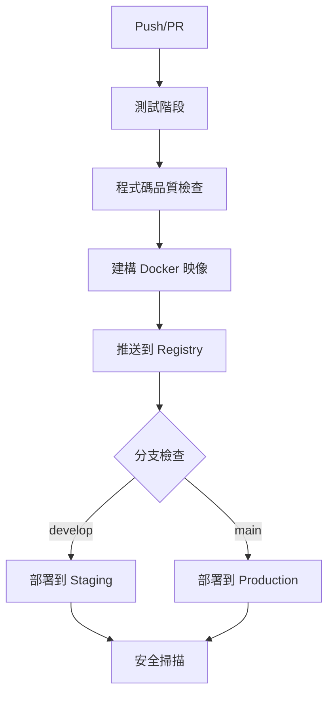

# 🚀 GitHub CI/CD 部署指南

本指南將協助您完整設置 GitHub Actions CI/CD 流程，實現自動化測試、建構和部署。

## 📋 目錄

1. [前置準備](#前置準備)
2. [GitHub Secrets 設置](#github-secrets-設置)
3. [CI/CD 工作流程說明](#cicd-工作流程說明)
4. [部署到 Google Cloud Platform](#部署到-google-cloud-platform)
5. [環境管理](#環境管理)
6. [監控和日誌](#監控和日誌)
7. [故障排除](#故障排除)
8. [最佳實踐](#最佳實踐)

## 🔧 前置準備

### 1. GitHub 專案設置

確保您的專案已經推送到 GitHub：

```bash
# 初始化 Git 倉庫（如果尚未初始化）
git init

# 添加遠端倉庫
git remote add origin https://github.com/njdgg/pill-reminder-linebot.git

# 推送程式碼
git add .
git commit -m "Initial commit with CI/CD setup"
git push -u origin main
```

### 2. 分支策略

建議使用以下分支策略：

- `main` - 生產環境分支
- `develop` - 開發環境分支
- `feature/*` - 功能開發分支

```bash
# 創建 develop 分支
git checkout -b develop
git push -u origin develop
```

### 3. 必要服務準備

確保您已經設置了以下服務：

- ✅ LINE Developers Console 帳戶
- ✅ Google Cloud Platform 專案
- ✅ MySQL 資料庫
- ✅ Google Gemini API 金鑰

## 🔐 GitHub Secrets 設置

### 步驟 1: 進入 GitHub Secrets 設置

1. 前往您的 GitHub 專案頁面
2. 點擊 `Settings` 標籤
3. 在左側選單中選擇 `Secrets and variables` > `Actions`
4. 點擊 `New repository secret`

### 步驟 2: 添加必要的 Secrets

#### LINE Bot 相關 Secrets

| Secret 名稱 | 說明 | 範例值 |
|------------|------|--------|
| `LINE_CHANNEL_ACCESS_TOKEN` | LINE Bot 頻道存取權杖 | `VNTjUiiei6DpRmdIJErR99Dr...` |
| `LINE_CHANNEL_SECRET` | LINE Bot 頻道密鑰 | `f023b0392df0ca5557b6afbc...` |
| `YOUR_BOT_ID` | LINE Bot ID | `@376gudmn` |
| `LIFF_CHANNEL_ID` | LIFF 頻道 ID | `2007537445` |
| `LIFF_ID_CAMERA` | 相機 LIFF ID | `2007537445-GOR4mN4Q` |
| `LIFF_ID_EDIT` | 編輯 LIFF ID | `2007537445-kJlZbPZ3` |
| `LIFF_ID_PRESCRIPTION_REMINDER` | 處方提醒 LIFF ID | `2007537445-OD8zXyzL` |
| `LIFF_ID_MANUAL_REMINDER` | 手動提醒 LIFF ID | `2007537445-8pA02w0D` |
| `LIFF_ID_HEALTH_FORM` | 健康表單 LIFF ID | `2007537445-3gebR8bZ` |
| `LINE_LOGIN_CHANNEL_ID` | LINE Login 頻道 ID | `2007537445` |
| `LINE_LOGIN_CHANNEL_SECRET` | LINE Login 頻道密鑰 | `4e48406a23fdb4c11fc6de48...` |

#### Google Cloud 相關 Secrets

| Secret 名稱 | 說明 | 取得方式 |
|------------|------|----------|
| `GCP_PROJECT_ID` | GCP 專案 ID | 在 GCP Console 中查看 |
| `GCP_SA_KEY` | 服務帳戶 JSON 金鑰 | [詳見下方說明](#google-cloud-服務帳戶設置) |
| `GEMINI_API_KEY` | Google Gemini API 金鑰 | `AIzaSyAoiOOrno52YguSy1ve...` |

#### 資料庫相關 Secrets

| Secret 名稱 | 說明 | 範例值 |
|------------|------|--------|
| `DB_HOST` | 資料庫主機位址 | `34.42.148.11` |
| `DB_USER` | 資料庫使用者名稱 | `root` |
| `DB_PASS` | 資料庫密碼 | `sql0626` |
| `DB_NAME` | 資料庫名稱 | `pill_test` |
| `DB_PORT` | 資料庫連接埠 | `3306` |

#### 其他 Secrets

| Secret 名稱 | 說明 | 範例值 |
|------------|------|--------|
| `SECRET_KEY` | Flask 應用程式密鑰 | `pill-recognition-bot-secret-key-2025` |

### Google Cloud 服務帳戶設置

#### 步驟 1: 創建服務帳戶

```bash
# 設置專案 ID
export PROJECT_ID="your-project-id"

# 創建服務帳戶
gcloud iam service-accounts create github-actions \
    --description="Service account for GitHub Actions" \
    --display-name="GitHub Actions"

# 獲取服務帳戶 email
export SA_EMAIL="github-actions@${PROJECT_ID}.iam.gserviceaccount.com"
```

#### 步驟 2: 分配權限

```bash
# Cloud Run 管理員權限
gcloud projects add-iam-policy-binding $PROJECT_ID \
    --member="serviceAccount:$SA_EMAIL" \
    --role="roles/run.admin"

# Storage 管理員權限
gcloud projects add-iam-policy-binding $PROJECT_ID \
    --member="serviceAccount:$SA_EMAIL" \
    --role="roles/storage.admin"

# 服務帳戶使用者權限
gcloud projects add-iam-policy-binding $PROJECT_ID \
    --member="serviceAccount:$SA_EMAIL" \
    --role="roles/iam.serviceAccountUser"
```

#### 步驟 3: 創建並下載金鑰

```bash
# 創建金鑰檔案
gcloud iam service-accounts keys create key.json \
    --iam-account=$SA_EMAIL

# 將金鑰內容複製到 GitHub Secrets
cat key.json
```

將輸出的 JSON 內容完整複製到 GitHub Secrets 中的 `GCP_SA_KEY`。

## 🔄 CI/CD 工作流程說明

### 主要工作流程 (ci-cd.yml)



#### 觸發條件

- **Push 到 main/develop 分支**: 執行完整的 CI/CD 流程
- **Pull Request 到 main 分支**: 執行測試和品質檢查
- **手動觸發**: 可在 GitHub Actions 頁面手動執行

#### 工作流程階段

1. **測試階段** (`test` job)
   - 設置 Python 3.11 環境
   - 安裝依賴項目
   - 執行程式碼風格檢查 (flake8)
   - 測試應用程式啟動

2. **建構和推送階段** (`build-and-push` job)
   - 建構 Docker 映像
   - 推送到 GitHub Container Registry
   - 生成映像標籤和元數據

3. **部署階段** (`deploy-staging`/`deploy-production` jobs)
   - 根據分支自動選擇環境
   - 部署到對應的環境

4. **安全掃描階段** (`security-scan` job)
   - 使用 Trivy 掃描容器漏洞
   - 上傳結果到 GitHub Security 標籤

### GCP 部署工作流程 (deploy-gcp.yml)

#### 觸發條件

- **Push 到 main 分支**: 自動部署到 production
- **手動觸發**: 可選擇部署環境 (staging/production)

#### 部署步驟

1. **認證到 Google Cloud**
2. **建構 Docker 映像**
3. **推送到 Google Container Registry**
4. **部署到 Cloud Run**
5. **執行健康檢查**

## 🌍 部署到 Google Cloud Platform

### Cloud Run 服務配置

部署時會自動配置以下 Cloud Run 設定：

```yaml
資源配置:
  - 記憶體: 1Gi
  - CPU: 1 vCPU
  - 超時時間: 300 秒
  - 並發數: 80
  - 最大實例數: 10

網路配置:
  - 允許未經認證的請求
  - 區域: us-central1
```

### 環境變數管理

所有環境變數都會從 GitHub Secrets 自動注入到 Cloud Run 服務中。

### 自定義部署配置

如需修改部署配置，編輯 `.github/workflows/deploy-gcp.yml` 中的 `gcloud run deploy` 命令：

```bash
gcloud run deploy $SERVICE_NAME \
  --image gcr.io/$PROJECT_ID/$SERVICE_NAME:$GITHUB_SHA \
  --platform managed \
  --region $REGION \
  --allow-unauthenticated \
  --memory 2Gi \              # 增加記憶體
  --cpu 2 \                   # 增加 CPU
  --timeout 600 \             # 增加超時時間
  --concurrency 100 \         # 增加並發數
  --max-instances 20          # 增加最大實例數
```

## 🏗️ 環境管理

### 環境分離

| 環境 | 分支 | 部署觸發 | 用途 |
|------|------|----------|------|
| **Development** | `feature/*` | 手動 | 功能開發測試 |
| **Staging** | `develop` | 自動 | 整合測試 |
| **Production** | `main` | 自動 | 正式環境 |

### 環境特定配置

#### Staging 環境

```bash
# 服務名稱後綴
SERVICE_NAME="${SERVICE_NAME}-staging"

# 較小的資源配置
--memory 512Mi
--cpu 0.5
--max-instances 3
```

#### Production 環境

```bash
# 正式服務名稱
SERVICE_NAME="${SERVICE_NAME}"

# 完整資源配置
--memory 1Gi
--cpu 1
--max-instances 10
```

### GitHub Environments

建議設置 GitHub Environments 來管理不同環境的部署：

1. 前往 `Settings` > `Environments`
2. 創建 `staging` 和 `production` 環境
3. 為 `production` 環境設置審核規則

## 📊 監控和日誌

### GitHub Actions 監控

1. **工作流程狀態**: 在 `Actions` 標籤查看執行狀態
2. **徽章顯示**: README.md 中的狀態徽章
3. **通知設置**: 在 GitHub 設定中配置失敗通知

### Cloud Run 監控

```bash
# 查看服務狀態
gcloud run services describe $SERVICE_NAME --region=$REGION

# 查看日誌
gcloud logs read "resource.type=cloud_run_revision" --limit=50

# 查看指標
gcloud monitoring metrics list --filter="resource.type=cloud_run_revision"
```

### 健康檢查端點

應用程式提供健康檢查端點：

```bash
# 檢查服務健康狀態
curl https://your-service-url/health

# 預期回應
{
  "status": "healthy",
  "timestamp": "2024-01-01T00:00:00Z",
  "version": "1.0.0"
}
```

## 🔧 故障排除

### 常見問題和解決方案

#### 1. GitHub Actions 失敗

**問題**: 測試階段失敗
```bash
# 檢查錯誤日誌
# 常見原因：
- 依賴項目安裝失敗
- 程式碼風格檢查不通過
- 環境變數缺失
```

**解決方案**:
```bash
# 本地測試
pip install -r requirements.txt
flake8 app/
python -c "from app import create_app; create_app('config.Config')"
```

#### 2. Docker 建構失敗

**問題**: Docker 映像建構失敗
```bash
# 常見原因：
- Dockerfile 語法錯誤
- 依賴項目安裝失敗
- 檔案路徑錯誤
```

**解決方案**:
```bash
# 本地測試 Docker 建構
docker build -t test-image .
docker run --rm test-image python -c "print('OK')"
```

#### 3. GCP 部署失敗

**問題**: Cloud Run 部署失敗
```bash
# 常見原因：
- 服務帳戶權限不足
- 環境變數設置錯誤
- 資源配置問題
```

**解決方案**:
```bash
# 檢查服務帳戶權限
gcloud projects get-iam-policy $PROJECT_ID

# 手動部署測試
gcloud run deploy test-service \
  --image gcr.io/$PROJECT_ID/test-image \
  --region us-central1
```

#### 4. 環境變數問題

**問題**: 應用程式無法讀取環境變數

**檢查清單**:
- ✅ GitHub Secrets 是否正確設置
- ✅ Secret 名稱是否與工作流程中一致
- ✅ 是否有特殊字符需要轉義

#### 5. 網路連接問題

**問題**: 無法連接到外部服務 (資料庫、API)

**解決方案**:
```bash
# 檢查 Cloud Run 網路設置
gcloud run services describe $SERVICE_NAME --region=$REGION

# 測試網路連接
curl -v https://your-database-host:3306
```

### 調試技巧

#### 1. 啟用詳細日誌

在工作流程中添加調試步驟：

```yaml
- name: Debug Environment
  run: |
    echo "Current directory: $(pwd)"
    echo "Environment variables:"
    env | grep -E "(LINE_|DB_|GEMINI_)" | sort
    echo "Docker version: $(docker --version)"
    echo "Python version: $(python --version)"
```

#### 2. 使用 SSH 調試

在需要時添加 SSH 調試步驟：

```yaml
- name: Setup tmate session
  if: failure()
  uses: mxschmitt/action-tmate@v3
  timeout-minutes: 15
```

#### 3. 保存調試資訊

```yaml
- name: Upload logs
  if: failure()
  uses: actions/upload-artifact@v3
  with:
    name: debug-logs
    path: |
      *.log
      /tmp/*.log
```

## ✅ 最佳實踐

### 1. 安全性最佳實踐

- **🔐 敏感資訊管理**
  - 所有 API 金鑰和密碼都使用 GitHub Secrets
  - 定期輪換 API 金鑰
  - 使用最小權限原則

- **🛡️ 程式碼安全**
  - 啟用 Dependabot 自動更新依賴
  - 定期執行安全掃描
  - 使用 .gitignore 防止敏感檔案提交

### 2. 效能最佳實踐

- **⚡ 建構優化**
  - 使用 Docker 多階段建構
  - 啟用 GitHub Actions 快取
  - 優化 Docker 映像大小

- **🚀 部署優化**
  - 使用藍綠部署策略
  - 設置適當的資源限制
  - 配置自動擴展

### 3. 監控最佳實踐

- **📊 監控設置**
  - 設置健康檢查端點
  - 配置日誌聚合
  - 設置告警通知

- **📈 效能監控**
  - 監控回應時間
  - 追蹤錯誤率
  - 監控資源使用率

### 4. 開發流程最佳實踐

- **🔄 Git 工作流程**
  - 使用功能分支開發
  - 要求 Pull Request 審核
  - 保持提交歷史清潔

- **🧪 測試策略**
  - 編寫單元測試
  - 實施整合測試
  - 使用測試覆蓋率報告

### 5. 文檔最佳實踐

- **📝 文檔維護**
  - 保持 README 更新
  - 記錄 API 變更
  - 維護部署日誌

## 🎯 下一步

完成基本設置後，您可以考慮以下進階功能：

1. **🔄 進階 CI/CD**
   - 添加更多測試類型
   - 實施金絲雀部署
   - 設置回滾機制

2. **📊 監控增強**
   - 整合 Google Cloud Monitoring
   - 設置自定義指標
   - 配置告警規則

3. **🔒 安全增強**
   - 實施 SAST/DAST 掃描
   - 添加合規性檢查
   - 設置安全政策

4. **⚡ 效能優化**
   - 實施 CDN
   - 優化資料庫查詢
   - 添加快取層

---

## 📞 支援

如果您在部署過程中遇到問題：

1. 📖 查看 [GitHub Actions 文檔](https://docs.github.com/en/actions)
2. 🔍 搜尋 [GitHub Community](https://github.community/)
3. 📧 聯繫專案維護者
4. 🐛 提交 [Issue](https://github.com/njdgg/pill-reminder-linebot/issues)

**祝您部署順利！** 🚀